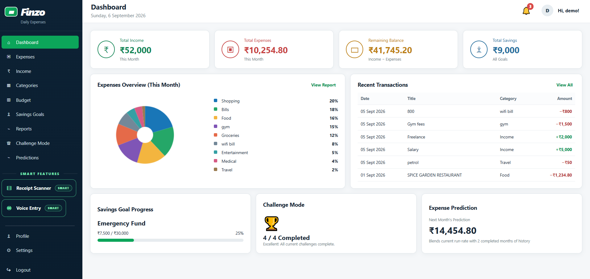
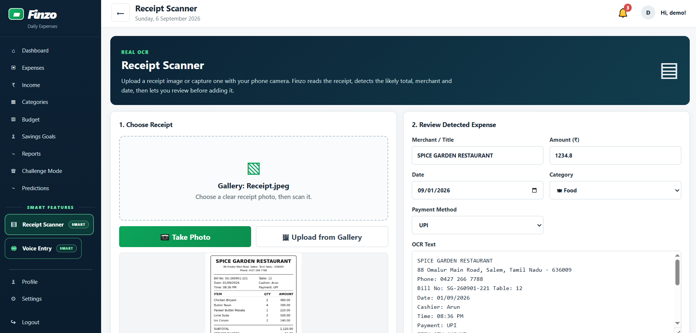
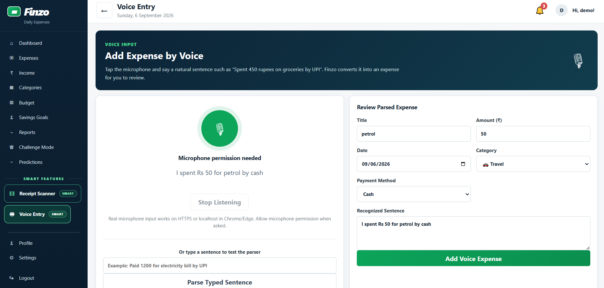
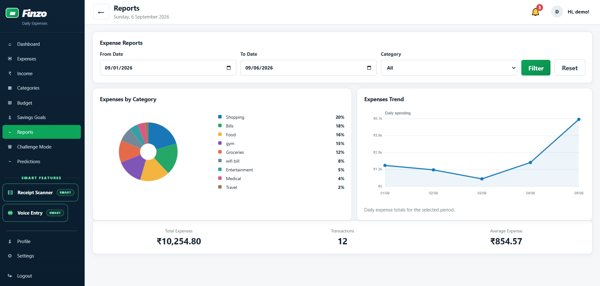
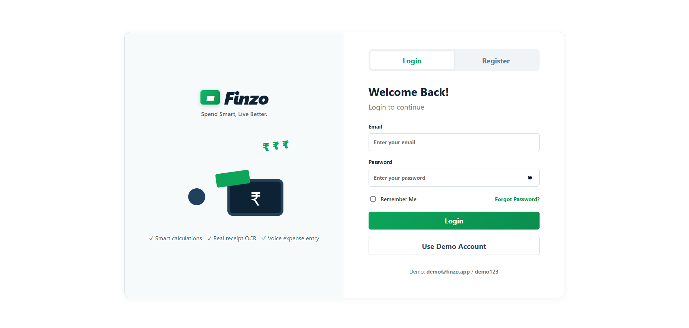

# FINZO — Smart Personal Expense Tracker

**A practical personal finance web app built to make everyday expense tracking faster, clearer, and easier.**

[Live Demo](https://finzofinalsourcecode.vercel.app/) · [LinkedIn](https://www.linkedin.com/in/mohamed-yusuf-ab2b6230a) · [GitHub Profile](https://github.com/yusuf-digital)

> Portfolio showcase repository. The complete deployable source code is kept private.

## What FINZO Does

FINZO brings daily money management into one responsive web app. Users can track income and expenses, manage budgets and savings goals, scan receipts, add expenses by voice, review visual reports, and understand future spending patterns.

## Key Features

- Income and expense tracking
- Add, edit, delete, and search transactions
- Custom expense categories
- Monthly budget tracking
- Savings goal tracking
- Receipt scanning with OCR
- Voice-based expense entry
- Typed natural-language expense entry
- Category and trend reports
- Future expense prediction
- Challenge Mode
- Budget and spending notifications
- Backup export and restore
- Login, registration, forgot password, remember me, and logout
- Responsive desktop, tablet, and mobile interface

## Smart Inputs

### Receipt Scanner
Upload or capture a receipt and FINZO uses OCR to extract readable information, then prepares the expense details for review before saving.

### Voice Expense Entry
Users can speak naturally, for example:

> “Spent 450 rupees on groceries by UPI.”

FINZO converts the sentence into structured expense details such as amount, category, and payment method.

## Tech Stack

| Technology | Used For |
|---|---|
| HTML5 | App structure and forms |
| CSS3 | Responsive layout and UI |
| JavaScript | App logic, calculations, reports, and predictions |
| Tesseract.js | Receipt OCR |
| Web Speech API | Voice expense entry |
| HTML Canvas | Charts and data visualization |
| localStorage / sessionStorage | Browser-side app and session data |
| Browser File API | Receipt images, profile photos, backup import/export |
| Browser History API | Navigation and back-button handling |
| Vercel | Deployment |

## Screenshots

### Dashboard

### Receipt Scanner

### Voice Expense Entry

### Reports

### Login

## Application Flow

**Login / Register → Dashboard → Expenses → Income → Categories → Budget → Savings Goals → Reports → Challenge Mode → Predictions → Receipt Scanner → Voice Entry → Profile → Settings → Logout**

## Why I Built It

FINZO was built as a practical project focused on solving a common daily problem: keeping personal expenses organized without making the process feel complicated. The project combines finance tracking with OCR, voice input, analytics, and responsive web design in one workflow.

## Project Highlights

**OCR · Voice Input · Budgeting · Savings · Analytics · Predictions · Responsive UI**

## Author

**Mohamed Yusuf**  
Digital Marketing · AI Automation · Vibe Coding

[LinkedIn](https://www.linkedin.com/in/mohamed-yusuf-ab2b6230a) · [GitHub](https://github.com/yusuf-digital)
